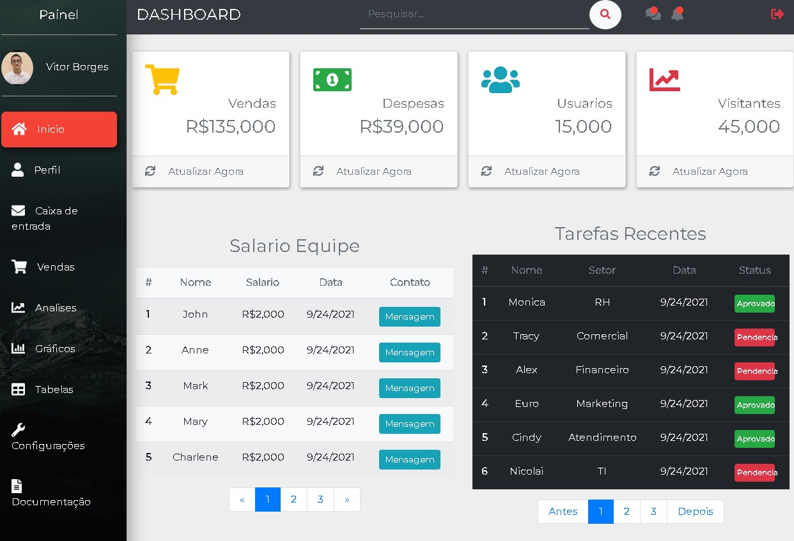

# O que você vai aprender aqui

- Como manipular tags de link com jQuery e o atributo data-html: `<a href="#" data-toggle="tooltip" data-html="true" title="<h6>edit</h6>" data-placement="top">...</a>`

- Como usar Bootstrap Cards, Barras de Progresso, Paginação, Modais, Acordeões e Tabelas

- Uma melhor compreensão do sistema de grade do Bootstrap com aninhamento, configuração e layout para uma página da Web mais responsiva

# Dashboard

Uma pagina de dashboard / painel basico para se utilizar dentro de uma empresa

## Mais informações sobre : 

- Link github : https://github.com/vitorborqge/Dashboard

  <a href='https://github.com/vitorborqge/Dashboard'>
  
  <!--  -->
  </a>

 

## Tecnologias Utilizadas 🚀

- HTML
- CSS3
- JAVASCRIPT
